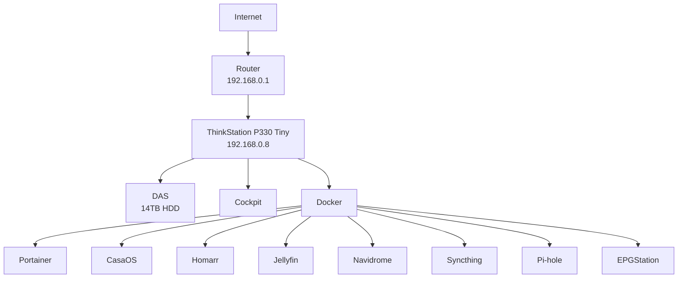

# サーバ構成図

## 全体構成

```mermaid
flowchart TD

Internet[Internet]

Router[Router<br>192.168.0.1]

Server[ThinkStation P330 Tiny<br>192.168.0.8]

Storage[DAS<br>14TB HDD]


Internet --> Router
Router --> Server
Server --> Storage


Server --> Cockpit
Server --> Docker


Docker --> Portainer
Docker --> CasaOS
Docker --> Homarr

Docker --> Jellyfin
Docker --> Navidrome
Docker --> Syncthing
Docker --> Pi-hole
Docker --> EPGStation
```